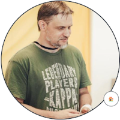

# ege-25

## ЕГЭ Информатика и ИКТ  

  

### БЕЛЯКОВ Андрей Юрьевич  

[Обо мне](https://permcoding.github.io/)  

> тлф. 8 (919) 49 13 818  

### Дистанционные занятия тут:  

> Начинаем каждое занятие с Яндекс-телемоста  
> Zoom и Skype - дополнительные точки входа (на всякий случай)  

1. [Войти в Яндекс-телемост](https://telemost.yandex.ru/j/05787508074338)  
2. [Войти в Zoom Конференцию](https://us04web.zoom.us/j/5768558245?pwd=onF4geABMahDkPwjSZoWd2tXZRS0rm.1)  
   Идентификатор конференции: **576 855 8245** ;  Код доступа: **1vAGEb**  
3. [Войти в Skype Конференцию](https://join.skype.com/invite/pquO5j6tFO0g)  
4. [ссылка на доску для занятий](https://flip-chart.ru/app/board?spaceId=01JENM6H7JX24TTWX3VDA8N5H1&teamId=01JENM6HA3Y0K0V7JP2DS59572&flipId=01JENM9B9XH7APN21H682ZV2JF)  
   Требуется сначала вступить в пространство по email  

---  

### Для работы потребуется установить:  

1. [Python + IDLE](https://www.python.org/downloads/)  
2. [LibreOffice](https://www.libreoffice.org/download/download-libreoffice/)  
3. [Наэкранное перо](https://mega.nz/file/YMY2XKRb#vzrBEkSBRx7PhH3Bi5rsrgKXkph_eKDTswUo5rTkC9s)  
4. [VS Code](https://code.visualstudio.com/)  
5. [КУМИР](https://www.niisi.ru/kumir/dl.htm)  

---  

### Где будем брать задачи для тренировок:  

* [kompege](https://kompege.ru/)  
* [задачи ЕГЭ sdamgia](https://inf-ege.sdamgia.ru/)  
* [Yandex ЕГЭ](https://education.yandex.ru/ege?utm_source=platform&utm_medium=partner&utm_campaign=ege&utm_content=cege_link_kabanov&utm_term=20231101)  
* [Сайт Константина Полякова](https://kpolyakov.spb.ru/school/ege/tests.htm)  
* [Мои задачи на Stepik](https://stepik.org/course/63529/syllabus)  

---  

### Перечень программного обеспечения  

для проведения ЕГЭ по информатике в 2025 году:  

- Текстовые редакторы: LibreOffice Writer, Microsoft Office Word, текстовый редактор Р7-Офис.  

- Редакторы электронных таблиц: LibreOffice Calc, Microsoft Office Excel, редактор таблиц Р7-Офис.  

- Среды программирования: PascalABC.NET, Free Pascal, PyCharm, IDLE (Python), Thonny, VS Code.  

- Языки программирования: C#, C++, Pascal, Java, Python.  

---  

Примерный прогноз на поступление в зависимости от баллов:  

- менее 8 первичных баллов (до 44 тестовых баллов) — экзамен не сдан, поступить в вуз нельзя  
- от 8 до 20 первичных баллов (до 80 тестовых баллов) — экзамен сдан, реально поступить на платное отделение в вуз  
- более 20 первичных баллов (от 80 тестовых баллов) — экзамен сдан, можно претендовать на бюджет  

Выпускников, получивших более 80 баллов по информатике, как правило, около 10-15% (это сложно, один из десяти).  

Средний балл сдачи ЕГЭ по Информатике в 2024 году - 54 балла.  

Для сравнения средние баллы по предметам за 2024 год:  

- Английский: 65,39  
- Русский язык: 63,88  
- Физика: 63,21  
- Математика профильная: 62,55  
- Литература: 60,92  
- История: 57,19  
- Химия: 56,55  
- География: 56,08  
- Обществознание: 55,05  
- Информатика: 54,49  
- Биология: 54,13  

---  

### Наши занятия  

Контрольные работы брать из папки `./ControlTasks/part_1/`  

```
... неделя 01  
04.12. - план подготовки на 80 баллов, условие Фано  

... неделя 02  
09.12. - задачи на условие Фано, первая проба программирования, переменные, функции, pow, round, ceil, floor  
11.12. - повторяем материал, основы программирования, циклы, ветвления, сравнение, "+="  
__.__. - выполнить самостоятельно **КР01 Условие Фано**  

... неделя 03  
16.12. - повторяем материал, Задача №19, одна и две кучи камней  
__.__. - порешай сам 2-3 задачи №19  
18.12. - решали задачу 19 на одну и две кучи, обсудили решение в Excel  
__.__. - выполнить самостоятельно **КР02 Теория игр - 2 хода**  
__.__. - порешай сам 2-3 задачи №20  

... неделя 04  
23.12. - обсудим **КР02**, порешаем №20 на одну кучу:  
  - 2 min - 16385, 17560, 17682, 17752 (+)  
  - 2 min - 17875 (-)  
  - 2 - 17638  
  - КР02 - не выполнил - перенесли  
__.__. - порешай сам 2-3 задачи №20 на одну кучу  
25.12. - ...  
  - обновим и настроим Python, обновим и настроим VS Code  
  - попробуем порешать №20 на две кучи и 3 хода:  
  - min+max: 18268  
  - min+min: 18199, 17532, 16330, 15336  
__.__. - выполнить самостоятельно **КР02 Теория игр - 2 хода**  
  
... неделя 05  
30.12. - ...  
  - обсудим КР02  
  - порешаем задачи №6  
  - повторим задачу №20 на две кучи и 3 хода:  
  - min+max: 18268  
  - min+min: 18199, 17532, 16330, 15336  
__.__. - выполнить самостоятельно **КР03 Теория игр - 3 хода**  

ПРИМЕРНЫЙ ТЕКУЩИЙ УРОВЕНЬ:  
- ЗАДАЧИ: 1, 4, 6, 10, 19, 20, ...  
- ИТОГО: 40 баллов  
- СЛЕДУЩИЕ: 18, 3, 5, 23, 2, 21  
- СЛЕДУЩИЕ: 7, 11, 17, 12, 16, 25  

... неделя 06  
08.01. - ...  
  - порешаем задачи №4 и №1  
  - обсудили формулы в LibreOffice, готовились к решению задачи 18  
__.__. - выполнить самостоятельно **КР03 Теория игр - 3 хода**  
__.__. - решить самостоятельно две задачи №01 про графы и пути  

... неделя 07  
13.01. - ... пн  
  - обсуждаем КР03  
  - решаем пару задач на графы  
  - решаем задачи №03 (19235, 19229, 18918, ...) - базы данных  
__.__.  - решить самостоятельно две задачи №03 c kompege.ru  
15.01. - ...  ср  
  - решали задачи  
  - новое - задача 18 - лабиринт  

... неделя 07  
20.01. - ... пн  
  - повторение  
  - задача 23 - колво программ  
22.01. - ... ср  
  - задача 23 - 18123, демо-25, ...
__.__. - дорешать самостоятельно задачу 23 с доп условиями №03 c kompege.ru  

... неделя 08  
27.01. - ... пн  
  - повторяем материал  
  - решаем задачу 16 - ...  
  - разберём простые алгоритмы с рекурсией  
  - организация материала и самоконтроль  
29.01. - ... ср  
  - разбор задачи 23 с доп условиями  
  - порешаем задачи 23 и 16  
  - до след пн выполнить **КР04 Графы**  

... неделя 08  
03.02. - ... пн  
  - разбор КР №4  
  - повторяем материал  
  - решаем задачу 7 и 5 ...  
05.02. - ... ср  
  - пусть фото занимает 3 бита, есть карты памяти по 10 бит  
    сколько карт памяти потребуется чтобы сохранить на них 10 фото ?  
  - решаем несколько задач №07 (19876, 19557, 19369, 19365, 19239, 19571)  
  - немного задача №05  
  - до след понедельника порешать 5 задач №07 (кодир изображ)  

... неделя 09  
10.02. - ... пн  
  - повторяем материал  
  - преверяем решение задачи 5  
  - решаем задачу 7 (кодир звука) ...  
  - немного задача №05  
12.02. - ... ср  
  - повторяем решение задачи №07 с кодированием изображений:  
  - 1) фото, если палитра из 256 разных цветов, то сколько битов достаточно, чтобы кодировать цвета пикселей?  
  - 2) фото, если палитра из 300 разных цветов, то сколько байтов достаточно, чтобы кодировать цвета пикселей?  
  - 3) фото разрешением 2048х1024 пикселей занимает 2 Мбайта, сколько бит используется для кодирования цвета каждого пикселя и какова максимальная палитра цветов может быть?  
  - 4) у фото стандартная RGB-кодировка, на каждый пиксель приходится три субпикселя по 8 бит, если фото разрешением 512х200 пикселей, то сколько килобайт оно "весит"?  
  - решаем задачи №7 с кодированием звука  
  - решаем задачи №05  
  - задача 11 (на след неделю)  
  - до след понедельника решить **КР05 Динамика**  

... неделя 10  
17.02. - ... пн  
  - повторяем материал  
  - решаем задачу 7 (кодир звука) ...  
  - решаем задачу 11  
  - решаем задачу 5  
19.02. - ... ср  
  - повторяем материал  
  - решаем задачу 7 (кодир звука) ...  
  - решаем задачу 5  
  - решаем задачу 11  
  - до след понедельника решить **КР06 Системы счисления**  

... неделя 11  
24.02. - ... пн  
  - проверяем КР  
  - решаем задачу 5  
  - решаем задачу 11  
  
26.02. - ... ср  
  - повторяем материал  

... неделя 12  
03.03. - ... пн  
  - повторяем материал  
  - решаем задачу 5, 12, 11  
  
05.03. - ... ср  
  - повторяем материал  
  - решаем задачу 5, 12, 11  

... неделя 13  
10.03. - ... пн  
  - повторяем материал  
  - решаем задачу 12, 5, 11  
  
12.03. - ... ср  
  - повторяем материал  
  - решаем задачу 12, 5, 11  

... неделя 14  
17.03. - ... пн  
  - повторяем материал  
  - решаем задачу 10, 6  
  - новая задача - 02  
  
19.03. - ... ср  
  - повторяем материал  
  - решаем задачи ...  

... неделя 14  
24.03. - ... пн  
  - повторяем материал  
  - решаем задачи 02, 07, 11  
  
26.03. - ... ср  
  - решить - 18576  
  - повторяем материал  
  - решаем задачи 02 и 11  

... неделя 14  
31.03. - ... пн  
  - повторяем материал  
  - решаем задачи 02, 07, 11  
  
02.04. - ... ср  
  - решаем задачи 11 - 19560, 20187, 19360, 19561, 19877  
  - повторяем материал  

... неделя 14  
07.04. - ... пн  
  - повторяем материал  
  - решаем задачи 17, 07, 11  
  
09.04. - ... ср  
  - выкатили новый вариант - Досрочная волна 2025 - будем его решать  
  - установим КУМИР и порешаем там задачи 06  
  
```

---  

```txt
текущий уровень:
 1 граф
 3 база данных
 4 Фано
 6 Черепаха
10 word
18 лабиринт
19 куча камней - 2 хода
20 куча камней - 3 хода

23 кол-во программ
16 рекурсивная функция
- - - - - - - - - 
итого:  
  - 10 первичных баллов
  - 51 итоговых баллов
- - - - - - - - - 
про системы счисления:
12 преобраз строки  
 5 число бинарное троичное ...
 7 кодиров рис или звука
11 кол-во инф
 2 логич операции, таблица истинности
- - - - - - - - - 
итого:
  - 15 первичных баллов
  - 64 итоговых баллов
- - - - - - - - - 
14 - на системы счисления  
17 - пары чисел по условию  
21 - игра, три хода  

18 - повторить
```

```txt
порешали 12/03/2025
ВЫВОД: на время не надо решать - спешить некуда, лучше решать медленно и тщательно
№ время
1 3
3 12
4  4
5  7
6 30
10 7
12 3
19 4
20 8
23 2
```

---  
